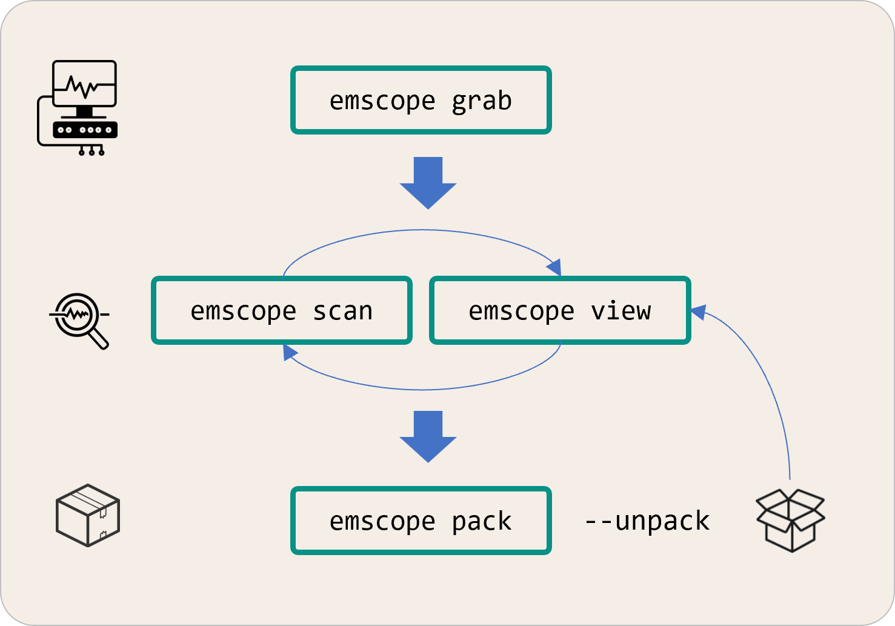

<p align="center">
    
</p>
<br>
<p align="center">
    
</p>

-----

<h3 align="center">
  <a href="#installation">Installation</a>&nbsp;&#xFF5C;&nbsp;
  <a href="#usage">Usage</a>&nbsp;&#xFF5C;&nbsp;
  <a href="#examples">Examples</a>&nbsp;&#xFF5C;&nbsp;
  <a href="#contributing">Contributing</a>&nbsp;&#xFF5C;&nbsp;
  <a href="#license">License</a>
</h3>

<br>

The **EM&bull;Scope** tool streamlines the capture, analysis, display, and delivery of real-time power-consumption measurements &ndash; used to characterize the overall energy efficiency of resource-constrained embedded systems.&thinsp; To encourage benchmarks for different HW/SW configurations performing comparable tasks, **EM&bull;Scope** introduces a novel metric for quantifying energy efficiency &ndash; the **EM&bull;erald**.
 
## Installation

```
npm install -g @em-foundation/emscope
```

> [!IMPORTANT]
> Until the 25.1.0 release of **EM&bull;Scope**, use
> ```
> npm install -g https://github.com/em-foundation/npm-packages/releases/download/resources/emscope-25.0.1.tgz
> ```

Enter `emscope -V` from the command-line to verify that installation has succeeded.&thinsp; You should also download and install the **Joulescope Application Software** (version 1.3.7) for your host computer from [here](https://download.joulescope.com/joulescope_install/index.html).

## Basic Usage

**EM&bull;Scope** has four primary modes of operation, corresponding to these `emscope` sub-commands:

<p align="center">
    
</p>

> [!TIP]
> Use `emscope help [sub-command]` to refresh your memory as well as to explore further.

Use of **EM&bull;Scope** centers around a _capture directory_ &ndash; populated initially with raw signal data acquired through the `emscope grab` sub-command.&thinsp;  Within the latter mode, you'll physically connect a **Joulescope** [JS220](https://www.joulescope.com/products/js220-joulescope-precision-energy-analyzer) or **Nordic** [PPK2](https://www.nordicsemi.com/Products/Development-hardware/Power-Profiler-Kit-2) to your target embedded system.

In practice, you'll typically begin using **EM&bull;Scope** with captures previously grabbed by others and then published within a curated **Git** repository.&thinsp; To support the examples which follow, go ahead and clone the [em-foundation/bleadv-captures](https://github.com/em-foundation/bleadv-captures) repo.

> [!NOTE]
> All of these captures record the energy consumped by different embedded HW/SW configurations otherwise performing the _same_ application task &ndash; transmitting a stock BLE packet on all three advertising channels once per-second with 0&thinsp;dB of radio power.
>
> We hope this embryonic repository will encourage others to contribute captures for a wide range of embedded BLE systems &ndash; enabling more rational and robust comparative benchmarks between different HW/SW providers who all claim "ultra-low-power".

Commanding `emscope pack --unpack` within any of the labeled capture directories in this repository will effectively download/deflate a special `emscope-capture.zip` file found in these folders.
