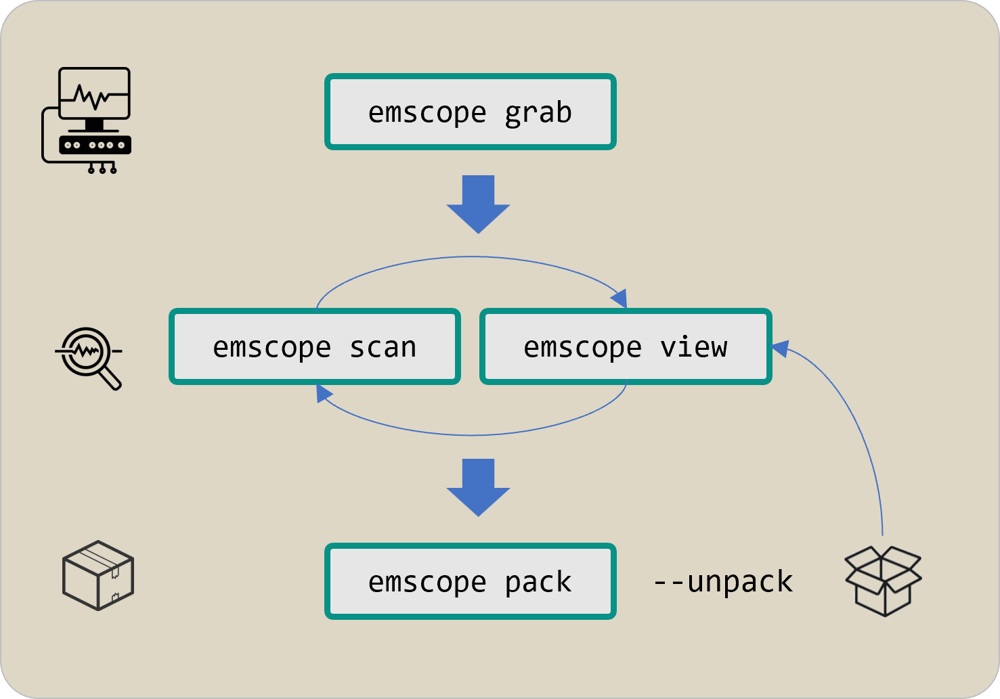

<p align="center">
    
</p>
<br>
<p align="center">
    
</p>

<br>
<br>
<br>

<p align="right">
  <sup><a href="README.md">for a better view <b>&#x27a6;</b></a></sup>
</p>

-----

<a id="toc"></a>

<h3 align="center">
  <a href="#installation">Installation</a>&nbsp;&#xFF5C;&nbsp;
  <a href="#usage">Usage</a>&nbsp;&#xFF5C;&nbsp;
  <a href="#examples">Examples</a>&nbsp;&#xFF5C;&nbsp;
  <a href="#contributing">Contributing</a>
</h3>

<br>

The **EM&bull;Scope** tool streamlines the capture, analysis, display, and delivery of real-time power-consumption measurements &ndash; used to characterize the overall energy efficiency of resource-constrained embedded systems.&thinsp; To encourage benchmarks for different HW/SW configurations performing comparable tasks, **EM&bull;Scope** introduces a novel metric for quantifying energy efficiency &ndash; the **EM&bull;erald**.
 
## Installation

```
npm install -g @em-foundation/emscope
```

> [!IMPORTANT]
> Until the 25.1.0 release of **EM&bull;Scope**, we will _not_ upload its package to the public `npm` registry.&thinsp; Instead, you'll find versions of this package named `emscope-<version>.tar.gz` archived on our **GitHub** [releases](http://github.com/em-foundation/emscope/releases) page.&thinsp; Copy the link of your choice (likely the latest) and then execute the following command:
> ```
> npm ci -g <package URL> 
> ```

Enter `emscope -V` from the command-line to verify that installation has succeeded.&thinsp; You should also install version 1.3.8 or later of the **Joulescope Application Software** for your host computer from the [Joulescope downloads](https://download.joulescope.com/joulescope_install/index.html) page.

> [!TIP]
> Stock installers for **Windows** and **macOS** will place this software in known locations.&thinsp; **Ubuntu** users must first unpack a `.tar.gz` file and then ensure the shell can find the `joulescope_launcher` executable along its `PATH`.

## Usage

**EM&bull;Scope** has four primary modes of operation, corresponding to these `emscope` sub-commands:

<p align="center">
    
</p>

> [!TIP]
> Use `emscope help [sub-command]` to refresh your memory as well as to explore further.

Use of **EM&bull;Scope** centers around a _capture directory_ &ndash; populated initially with raw signal data acquired through the `emscope grab` sub-command.&thinsp;  Within the latter mode, you'll physically connect a **Joulescope** [JS220](https://www.joulescope.com/products/js220-joulescope-precision-energy-analyzer) or **Nordic** [PPK2](https://www.nordicsemi.com/Products/Development-hardware/Power-Profiler-Kit-2) to your target embedded system.

In practice, you'll typically begin using **EM&bull;Scope** with captures previously grabbed by others and then published within a curated **Git** repository.&thinsp; To support the examples which follow, we've prepared the [em-foundation/bleadv-captures](https://github.com/em-foundation/bleadv-captures) repo which you'll provision locally.

> [!WARNING]
> The `bleadv-captures` repo stores (large) `emscope-capture.zip` files using **Git LFS** pointers.&thinsp; We'll soon illustrate how to clone this repo as well as deflate its `emscope-capture.zip` files onto your host computer using `emscope pack --unpack`.

At this stage, you would use the `emscope scan` and `emscope view` commands to explore raw signal data captured at an earlier time &ndash; as if you had just executed `emscope grab`.

Only the original supplier of the raw data, however, would use `emscope pack` to create `emscope-capture.zip` files.&thinsp; The supplier would then commit this file (and other **EM&bull;Scope** artifacts) into the capture repository &ndash; ready for downstream consumption by others.

> [!IMPORTANT]
> All of these captures record the energy consumed by different embedded HW/SW configurations otherwise performing the _same_ application task &ndash; transmitting a stock BLE packet on all three advertising channels once per-second with 0&thinsp;dB of radio power.
>
> We hope this embryonic repository will encourage others to contribute captures for a wide range of embedded BLE systems &ndash; enabling more rational and robust comparative benchmarks between different HW/SW providers who all claim "ultra-low-power".

## Examples

### 🟠&ensp;recording raw power signals &emsp; <p align="right"><sup><a href="#toc">top ⤴️</a></sup></p>
<a id="grab"></a>
```console
$ emscope grab -J
    wrote 'capture.yaml'
    analyzing captured data...
    found 3 event(s)
    wrote 'analysis.yaml'

$ emscope grab -J -d 12
    wrote 'capture.yaml'
    analyzing captured data...
    found 12 event(s)
    wrote 'analysis.yaml'
```

> [!NOTE]
> Capture raw data using an attached **Joulescope JS220** power analyzer, wired to your target system; the `-d, --duration` option specifies the capture duration in seconds (default: 3).&thinsp; We'll explain more about the generated output shortly.

<br> 

```console
$ emscope grab -PA
    wrote 'capture.yaml'
    analyzing captured data...
    found 3 event(s)
    wrote 'analysis.yaml'

$ emscope grab -PSV 1.8
    wrote 'capture.yaml'
    analyzing captured data...
    found 12 event(s)
    wrote 'analysis.yaml'
```

> [!NOTE]
> Capture raw data, but now using an attached **Nordic PPK2** analyzer.&thinsp; This analyzer has two alternative operating modes selected by an additional `emscope grab` option (`-A, --ampere-mode` or `-S, --source-mode`); wiring to your target will likely differ in each case.
>
> Unlike the **JS220**, the **PPK2** does _not_ record the **V** (voltage) signal &ndash; only the **I** (current) signal.&thinsp; The `-V, --voltage` option (default: 3.3) basically informs `emscope` of this value &ndash; but also specifies the voltage _supplied_ by the **PPK2** itself when `-S, source-mode` applies.

---

> [!TIP]
> We'll run the remaining series of examples within the `ti-23-lp-slsdk-J` capture directory found in the [`bleadv-captures`](https://github.com/em-foundation/bleadv-captures) **Git** repository.&thinsp; If you want to play along at home, clone this repo and provision this capture directory as follows:
>
>```
> $ GIT_LFS_SKIP_SMUDGE=1 git clone --filter=blob:none https://github.com/em-foundation/bleadv-captures.git
> $ cd bleadv-captures
> $ git lfs install --local --skip-smudge
> $ cd ti-23-lp-slsdk-J
> $ emscope pack --unpack
>```
>
> Alternatively, execute `emscope pack -u -C` from the root of the `bleadv-captures` repo to apply this command to _all_ capture directories found therein.&thinsp; We'll have more to say about the `-C` option later on.

### 🟠&ensp;viewing captured information &emsp; <p align="right"><sup><a href="#toc">top ⤴️</a></sup></p>

```console
$ emscope view -s
    sleep current = 589.092 nA @ 3.29 V, standard deviation =  14.548 µA
```

> [!NOTE]
> The `-s, --sleep` option reports average power consumption during periods of inactivity within the target system &ndash; values that should align with a vendor data sheet.&thinsp; The standard deviation reflects  _recharge pulses_ which often occur during deep-sleep.

<br> 

<a id="view-s"></a>
```console
$ emscope view -e
    A :: time =  1.06 s, energy =  30.840 µJ, duration =   3.250 ms
    B :: time =  2.07 s, energy =  30.910 µJ, duration =   3.250 ms
    C :: time =  3.07 s, energy =  30.913 µJ, duration =   3.250 ms
    D :: time =  4.07 s, energy =  30.962 µJ, duration =   3.000 ms
    E :: time =  5.08 s, energy =  30.945 µJ, duration =   3.000 ms
    F :: time =  6.08 s, energy =  31.166 µJ, duration =   3.250 ms
    G :: time =  7.09 s, energy =  30.863 µJ, duration =   3.000 ms
    H :: time =  8.10 s, energy =  30.745 µJ, duration =   3.000 ms
    I :: time =  9.10 s, energy =  31.252 µJ, duration =   3.000 ms
    J :: time = 10.10 s, energy =  30.931 µJ, duration =   3.000 ms
    ----
    average energy over 10 event(s):  30.953 µJ
```

> [!NOTE]
> The `-e, --events` option lists information about each period of _activity_ detected in the raw signal data.&thinsp; When benchmarking different HW/SW target configurations, a set of 10 one-second event cycles provides a reasonable sample.  

<br> 

```console
$ emscope view -j
    wrote 'ti-23-lp-slsdk-J-events.jls'
    launching the Joulescope File Viewer...
```

> [!NOTE]
> The `-j, --jls-file` option launches the **Joulescope File Viewer** (installed earlier) with a generated `.jls` file containing the raw signal data, annotated with markers deliniating each of the active events listed earlier.
>
><p align="center">
>    
></p>

> [!TIP]
> Somewhat daunting at first, take some time to familiarize yourself with the **Joulescope File Viewer**.&thinsp; As you start zooming in on portions of the capture &ndash; and perhaps find yourself a little lost &ndash; simply exit the program and re-run the `emscope view -j` command.

<br> 

```console
$ emscope view -jB
    wrote 'ti-23-lp-slsdk-J-event-B.jls'
    launching the Joulescope File Viewer...
    generated 'ti-23-lp-slsdk-J-event-B.png'
```
> [!NOTE]
> This form of the `-j, --jls-file` option focuses upon a _single_ event designated through an alphabetic identifier seen [earlier](#view-s) in the output of the `emscope view -s` command.&thinsp; This variant also generates a screenshot of the event, suitable for publication.
> 
><p align="center">
>    
></p>

### 🟠&ensp;refining event detection &emsp; <p align="right"><sup><a href="#toc">top ⤴️</a></sup></p>

```console
$ emscope scan
    analyzing captured data...
    found 3 event(s)
    wrote 'analysis.yaml'
```

> [!NOTE]
> This command performs a baseline analysis of the raw signal data, discriminating event activity from periods of deep-sleep.&thinsp; Saving results to `analysis.yaml`, the `emscope grab` command seen [earlier](#grab) in fact performs an initial `emscope scan` after recording the data.

<br> 

```console
$ emscope scan -t
    analyzing captured data...
    found 1 event(s)
    wrote 'analysis.yaml'
```

> [!NOTE]
> The `-t, --trim` option will typically drop the first and last events of its analysis, ensuring that at least 500&thinsp;ms of inactivity occur on either end of the newly scanned data.&thinsp; If all goes well, a capture of duration _d&thinsp;_+&thinsp;2 seconds should yield a clean set of _d_ events. 

<br> 

```console
$ emscope scan -tg 5
    analyzing captured data...
    found 1 event(s)
    wrote 'analysis.yaml'
```

> [!NOTE]
> Adding in the `-g, --gap <milliseconds>` option coalesces adjacent events whose separation falls under a given threshold.&thinsp; Benign in most cases, this filter nevertheless has proven useful when working with some target systems.

---

> [!IMPORTANT]
> The `emscope scan` command will _always_ (re-)write the `analysis.yaml` file in the capture directory.&thinsp; Along with the `capture.yaml` file written [earlier](#grab) by `emscope grab`, this pair of special files source much of the information presented by `emscope view` &ndash; with the latter command often used in tandem with `emscope scan` to refine event analysis _before_ publishing the capture itself.

> [!TIP]
> Feel free, however, to use `emscope scan` within any of the capture directories published in the `bleadv-captures` **Git** repository &ndash; implicitly modifying some `analysis.yaml` file.&thinsp; To revert `ble-captures` to its original state, run the following command anywhere inside the repo:
> ```
> git -C "$(git rev-parse --show-toplevel)" reset --hard
> ```

### 🟠&ensp;publishing captured information &emsp; <p align="right"><sup><a href="#toc">top ⤴️</a></sup></p>

```
emscope pack
... prepare other capture directory artifacts
git commit ...   
```

> [!NOTE]
> By convention, you'll publish new captures created with `emscope grab` and refined with `emscope scan` within a **Git** repo.&thinsp; At a minimum, you'll commit the `capture.yaml` and `analysis.yaml` files described earlier as well as the (large) `emscope-capture.zip` generated here.
>
> Owners of the repo will often prescribe other required artifacts (such as a `README`) as well as naming conventions for the capture directory itself.&thinsp; The repo will _not_ in general retain generated `.jls` files &ndash; which clients can always reproduce with `emscope view` after cloning.

### 🟠&ensp;scoring energy efficiency &emsp; <p align="right"><sup><a href="#toc">top ⤴️</a></sup></p>

```console
$ emscope view -w
    event cycle duration: 00:00:01
    average sleep power:   1.941 µW
    ----
    representative event:  30.980 µJ
    energy per cycle:  32.921 µJ
    energy per day:   2.844 J
    ----
    28.13 EM•eralds
```

> [!NOTE]
> The `-w, --what-if` option summarizes the energy efficiency of previously captured power signals.&thinsp; Like all forms of `emscope view`, the underlying `analysis.yaml` file provides a source for this information but otherwise remains unmodified by this command.
>
> As you might imagine, the overwhelming percentage of energy consumed per 1&thinsp;s event-cycle happens in under 1% of real-time &ndash; an inherent and enduring trait of most "sleepy" applications for embedded systems.

<br>

```console
$ emscope-dev view -w 5
    event cycle duration: 00:00:05
    average sleep power:   1.941 µW
    ----
    representative event:  30.980 µJ
    energy per cycle:  40.684 µJ
    energy per day: 703.019 mJ
    ----
    113.79 EM•eralds

$ emscope view -w 2:00
    event cycle duration: 00:02:00
    average sleep power:   1.941 µW
    ----
    representative event:  30.980 µJ
    energy per cycle: 263.880 µJ
    energy per day: 189.994 mJ
    ----
    421.07 EM•eralds
```

> [!NOTE]
> The `-w, --what-if` accepts an optional value defining the event cycle duration in `hh:mm:ss` format &ndash; allowing us to extrapolate energy consumption in longer, more realistic periods.&thinsp; As expected, increasing cycle duration will _decrease_ energy consumption per day.

---

> [!IMPORTANT]
> The amount of energy consumed per day will plateau as cycle duration continues to lengthen &ndash; with sleep power dominating.&thinsp; Having said that, the magnititude of target sleep power coupled with its wakeup overhead can lead to some interesting energy consumption curves.

<br>

```console
$ emscope view --score
    28.13 EM•eralds
$ emscope view -w 5 --score
    113.79 EM•eralds
$ emscope view -w 2:00 --score
    421.07 EM•eralds
```

>[!NOTE]
> Using the `--score` option by itself (or in conjunction with `-w`) reduces output to a single metric &ndash; the **EM•erald**.&thinsp; Starting with an _energy per day_ value (as reported previously), we compute _energy per month_ and then divide this value into 2400 &ndash; yielding our final score.
>
> <p align="center"><b>EM•eralds = 2400 / (<i>Joules per day</i> * 30) = 800 / <i>Joules per day</i></b></p>
>
> Why 2400?&thinsp; Because this number approximates the amount of energy available in the ever-popular CR2032 coin-cell battery &ndash; rated at 225&thinsp;mAH and nominally delivering 3V.
>
><p align="center"><b>CR2032 energy:&nbsp; 225 mAh × 3.6 × 3.0 V ≈ 2.43 kJ</b></p>
><p align="center"><b>1 EM•erald ≈ 1 CR2032-month</b></p>
>
> More **EM•eralds**, more efficiency....&thinsp; And while our embedded system may use alternatives to the CR2032 battery as its source of energy, the industry has always touted _"five years on a coin-cell"_ as a laudable goal &ndash; which we'll now term a <i>60 <b>EM•erald</b> application</i>.

<br>

```console
$ cd .../bleadv-captures
$ emscope view --score -C '*-J'

adi-m17-evk-msdk-J:
    14.75 EM•eralds

in-100-dk-none-J:
    41.92 EM•eralds

nrf-52-dk-zephyr-J:
    27.72 EM•eralds

nrf-54-dk-zephyr-J:
    41.93 EM•eralds

ti-23-lp-emsdk-J:
    48.62 EM•eralds

ti-23-lp-slsdk-J:
    28.13 EM•eralds
```

>[!NOTE]
> The `-C, --capture-glob` option illustrated here will in general enable execution of some `emscope` command within _any_ child capture directory whose name matches a given pattern (default `'*'`).
>
> Typically run from the root of the capture repo to report multiple scores, the glob pattern allows you to further filter this list using metadata encoded (by convention) in each capture directory name &ndash; in this case, all captures grabbed with a **JS220**.

### Enjoy the ride&thinsp;!!! **🎢**

## Contributing

At this early stage of development, the **EM&bull;Scope** team has four requests to the community at large:

🟢 &ensp; re-read this introduction &ndash; and start a Q/A thread on our [Discussion](https://github.com/em-foundation/emscope/discussions/new?category=q-a) page<br>
🟢 &ensp; play with the `emscope` command &ndash; and file [Bug](https://github.com/em-foundation/emscope/issues/new?template=bug_report.md) or [Feature](https://github.com/em-foundation/emscope/issues/new?template=feature_request.md) issues when needed<br>
🟢 &ensp; consider publishing your own capture &ndash; and [**Fork**](https://github.com/em-foundation/bleadv-captures)🍴&thinsp;`bleadv-captures` to get going<br>
🟢 &ensp; encourage others to engage with **EM&bull;Scope** &ndash; and then [**Star**](https://github.com/em-foundation/emscope)⭐&thinsp; **&bull;** &thinsp;[**Watch**](https://github.com/em-foundation/emscope)👀 this repo<br>


