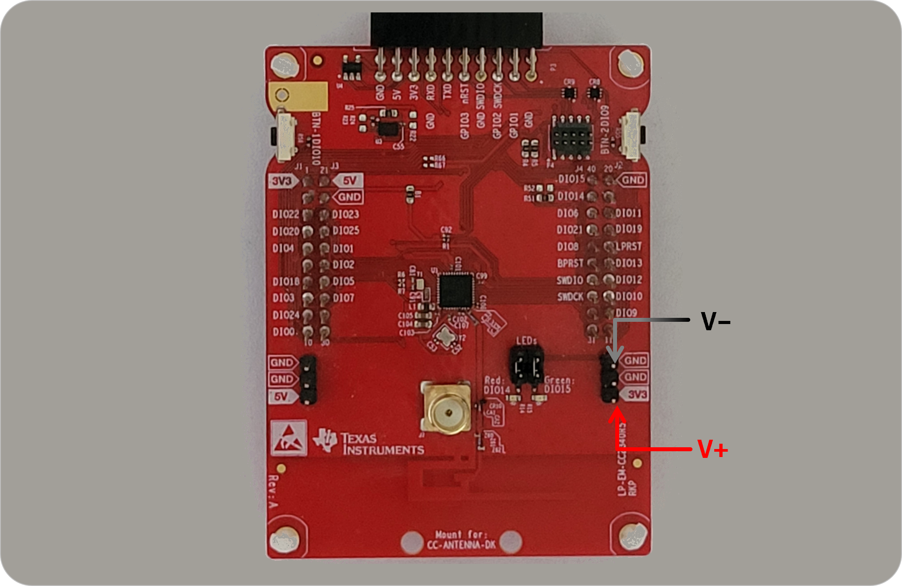

<h1 align="center">Texas Instruments CC2340R5 LaunchPad</h1>

## HW/SW Resources

* [CC2340R5 MCU](https://www.ti.com/product/CC2340R5) &ndash; 48&thinsp;MHz Cortex-M0+ &thinsp;|&thinsp; &le;&thinsp;512&thinsp;KB flash &thinsp;|&thinsp; &le;&thinsp;64&thinsp;KB SRAM
* [LP-EM-CC2340R5 dev kit](https://www.ti.com/tool/LP-EM-CC2340R5)

## Analyzer Connections

    

## Notes
