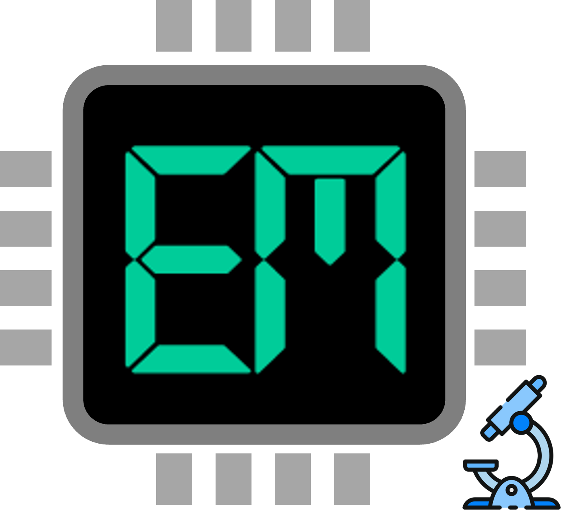
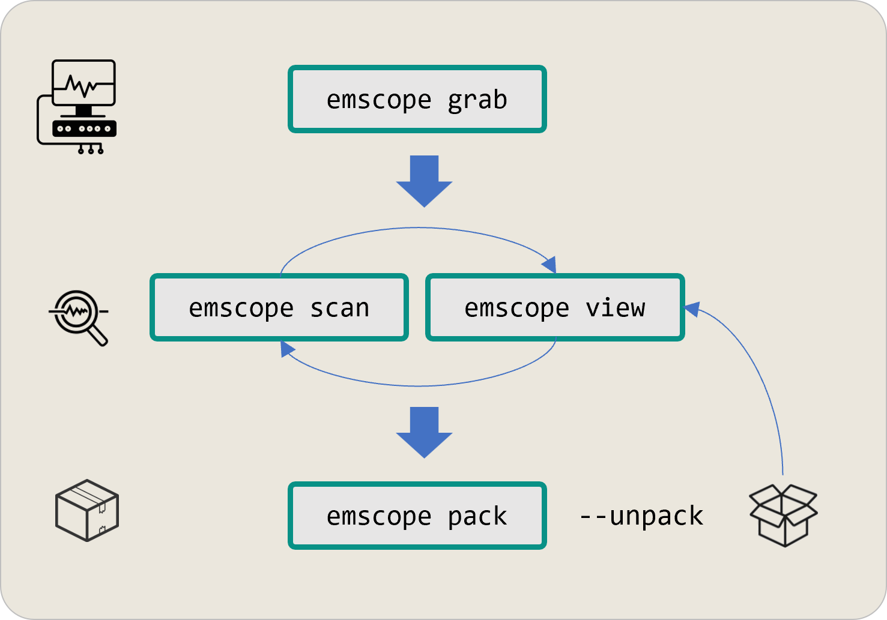
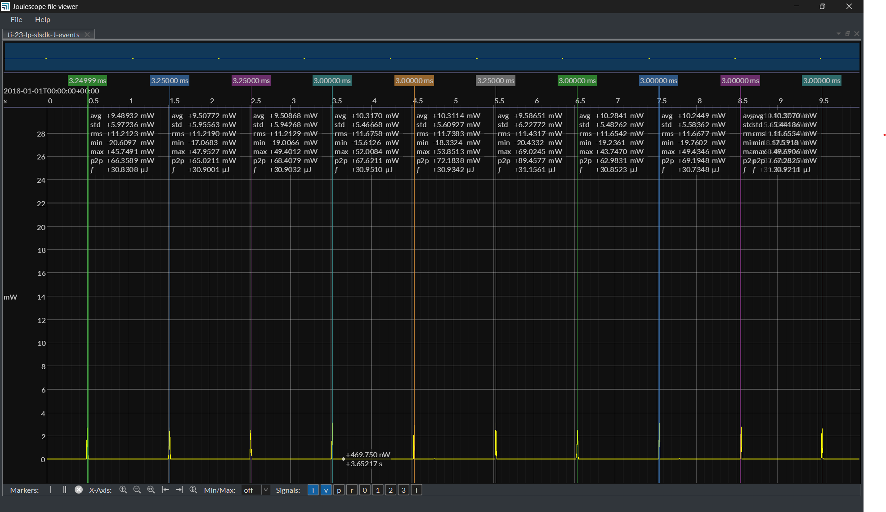
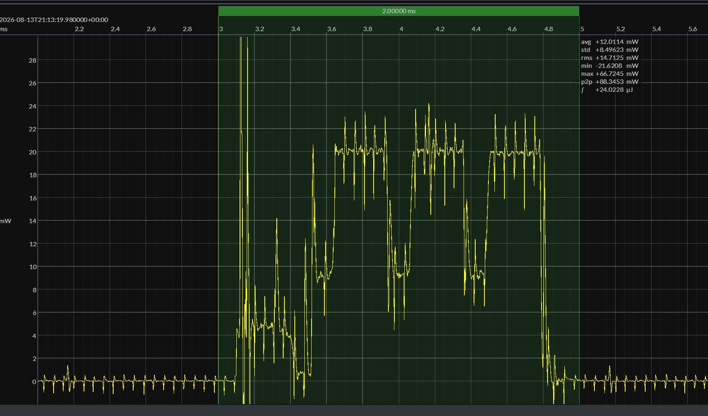

<p align="center">
    
</p>
<br>
<p align="center">
    
</p>

---

<a id="toc"></a>

<h3 align="center">
  <a href="#installation">Installation</a>&nbsp;&#xFF5C;&nbsp;
  <a href="#usage">Usage</a>&nbsp;&#xFF5C;&nbsp;
  <a href="#examples">Examples</a>&nbsp;&#xFF5C;&nbsp;
  <a href="#contributing">Contributing</a>
</h3>

<br>

The **EM&bull;Scope** tool streamlines the capture, analysis, display, and delivery of real-time power-consumption measurements for resource-constrained embedded systems.

## Installation

```
npm install -g @em-foundation/emscope
```

Enter `emscope -V` from the command-line to verify that installation has succeeded.

> [!IMPORTANT]
> See [below](#updating) for important information about updating the `emscope` package when necessary.

When using a **Joulescope JS220**, install the **Joulescope Application Software** [version 1.3.9](https://download.joulescope.com/joulescope_install/index.html) onto your host computer.

> [!TIP]
> Stock installers for **Windows** and **macOS** will place this software in known locations.&thinsp; **Ubuntu** users must first unpack a `.tar.gz` file and then ensure the shell can find the `joulescope_launcher` executable along its `PATH`.

## Usage

**EM&bull;Scope** has four main modes of operation, corresponding to these `emscope` sub-commands:

<p align="center">
    
</p>

> [!TIP]
> Use `emscope help [sub-command]` to refresh your memory as well as to explore further.

Use of **EM&bull;Scope** centers around a _capture directory_ &ndash; populated initially with raw signal data acquired through the `emscope grab` sub-command.&thinsp; Within the latter mode, you'll physically connect a **Joulescope** [JS220](https://www.joulescope.com/products/js220-joulescope-precision-energy-analyzer), **Nordic** [PPK2](https://www.nordicsemi.com/Products/Development-hardware/Power-Profiler-Kit-2), or **Qoitech** [Otii](https://www.qoitech.com/otii-ace/) analyzer to your target embedded system.

In practice, you'll often begin with captures published by others within a curated **Git** repository.&thinsp; The examples which follow use the [em-foundation/bluejoule-adv](https://github.com/em-foundation/bluejoule-adv) benchmark repo.

> [!WARNING]
> The `bluejoule-adv` repo stores (large) `emscope-capture.zip` files using **Git LFS** pointers.&thinsp; We'll soon illustrate how to clone this repo and restore capture data locally using `emscope pack --unpack`.

Once provisioned locally, use `emscope scan` and `emscope view` to inspect and refine previously captured signal data.

Capture suppliers use `emscope pack` to generate distributable capture artifacts, including `emscope-capture.zip`, `ABOUT.md`, and `about.json`.

## Examples

### 🟠&ensp;recording raw power signals &emsp; <p align="right"><sup><a href="#toc">top ⤴️</a></sup></p>

<a id="grab"></a>

> [!IMPORTANT]
> Even if you don't have a **Joulescope JS220**, **Nordic PPK2**, or **Qoitech Otii** analyzer at hand, understanding typical use of `emscope grab` sets the stage for other modes of the `emscope` command illustrated later.&thinsp; Use `-J`, `-P`, or `-O` to select the analyzer.

---

```console
$ emscope grab -J
    wrote 'capture.yaml'
    analyzing captured data...
    found 3 event(s)
    wrote 'analysis.yaml'

$ emscope grab -J -d 12
    wrote 'capture.yaml'
    analyzing captured data...
    found 12 event(s)
    wrote 'analysis.yaml'
```

> [!NOTE]
> Capture raw data using an attached **Joulescope JS220** power analyzer, wired to your target system; the `-d, --duration` option specifies the capture duration in seconds (default: 3).&thinsp; We'll explain more about the generated output shortly.

---

```console
$ emscope grab -PA
    wrote 'capture.yaml'
    analyzing captured data...
    found 3 event(s)
    wrote 'analysis.yaml'

$ emscope grab -PSv 1.8
    wrote 'capture.yaml'
    analyzing captured data...
    found 12 event(s)
    wrote 'analysis.yaml'
```

> [!NOTE]
> Capture raw data, but now using an attached **Nordic PPK2** analyzer.&thinsp; This analyzer has two alternative operating modes selected by an additional `emscope grab` option (`-A, --ampere-mode` or `-S, --source-mode`); wiring to your target HW will likely differ in each case.
>
> Unlike the **JS220**, the **PPK2** does _not_ record the **V** (voltage) signal &ndash; only the **I** (current) signal.&thinsp; The `-v, --voltage` option (default: 3.3) informs `emscope` of this value &ndash; but also specifies the voltage _supplied_ by the **PPK2** itself when `-S, source-mode` applies.

---

> [!TIP]
> We'll run the remaining examples within `captures/nrf-52832-emscript/3V3-J` in the [`bluejoule-adv`](https://github.com/em-foundation/bluejoule-adv) **Git** repository.&thinsp; To play along, clone the repo and restore its capture data:
>
> ```
> GIT_LFS_SKIP_SMUDGE=1 git clone --filter=blob:none https://github.com/em-foundation/bluejoule-adv.git
> cd bluejoule-adv
> git lfs install --local --skip-smudge
> emscope pack -u -C
> cd captures/nrf-52832-emscript/3V3-J
> ```

<br>

### 🟠&ensp;viewing captured information &emsp; <p align="right"><sup><a href="#toc">top ⤴️</a></sup></p>

---

```console
$ emscope view -s
    sleep current = 2.5 µA @ 3.3 V, standard deviation = 14.0 µA
```

> [!NOTE]
> The `-s, --sleep` option reports average power consumption during periods of inactivity within the target system &ndash; values that should align with a vendor data sheet.&thinsp; The standard deviation reflects _recharge pulses_ which often occur during deep-sleep.

---

<a id="view-e"></a>

```console
$ emscope view -e
    A :: time =  0.99 s, energy = 24.1 µJ, duration =  2.00 ms
    B :: time =  1.99 s, energy = 24.0 µJ, duration =  2.00 ms
    C :: time =  2.99 s, energy = 24.1 µJ, duration =  2.00 ms
    D :: time =  3.99 s, energy = 24.1 µJ, duration =  2.00 ms
    E :: time =  4.99 s, energy = 24.0 µJ, duration =  2.00 ms
    F :: time =  5.99 s, energy = 24.1 µJ, duration =  2.00 ms
    G :: time =  6.99 s, energy = 24.1 µJ, duration =  2.00 ms
    H :: time =  7.99 s, energy = 24.1 µJ, duration =  2.00 ms
    I :: time =  8.99 s, energy = 24.0 µJ, duration =  2.00 ms
    J :: time =  9.99 s, energy = 24.1 µJ, duration =  2.00 ms
    ----
    energy over 10 event(s): 24.1 µJ avg,  0.0 µJ std
    duration over 10 event(s):  2.0 ms avg,  0.0 ms std
```

> [!NOTE]
> The `-e, --events` option lists each detected event and summarizes event energy and duration across the analyzed set.

---

```console
$ emscope view -j
    wrote 'ti-23-lp-slsdk-J-events.jls'
    launching the Joulescope File Viewer...
```

> [!NOTE]
> The `-j, --jls-file` option launches the **Joulescope File Viewer** (installed earlier) with a generated `.jls` file containing the raw signal data, annotated with markers delineating each of the active events listed earlier.
>
> <p align="center">
>    
> </p>

> [!TIP]
> Somewhat daunting at first, take some time to familiarize yourself with the **Joulescope File Viewer**.&thinsp; As you start zooming in on portions of the capture &ndash; and perhaps find yourself a little lost &ndash; simply exit the program and re-run the `emscope view -j` command.

---

```console
$ emscope view -jB
    wrote 'ti-23-lp-slsdk-J-event-B.jls'
    launching the Joulescope File Viewer...
    generated 'ti-23-lp-slsdk-J-event-B.png'
```

> [!NOTE]
> This form of the `-j, --jls-file` option focuses upon a _single_ event designated through an alphabetic identifier seen [earlier](#view-e) in the output of the `emscope view -e` command.&thinsp; This variant also generates a screenshot of the event, suitable for publication.
>
> <p align="center">
>    
> </p>

<br>

### 🟠&ensp;refining event detection &emsp; <p align="right"><sup><a href="#toc">top ⤴️</a></sup></p>

---

```console
$ emscope scan
    analyzing captured data...
    found 12 event(s)
    wrote 'analysis.yaml'
```

> [!NOTE]
> This command performs a baseline analysis of the raw signal data, discriminating event activity from periods of deep-sleep.&thinsp; Saving results to `analysis.yaml`, the `emscope grab` command seen [earlier](#grab) in fact performs an initial `emscope scan` after recording the data.

---

```console
$ emscope scan -t10
    analyzing captured data...
    found 10 event(s)
    wrote 'analysis.yaml'
```

> [!NOTE]
> The `-t, --trim` option updates `analysis.yaml` to contain a specific number of events bounded by &ge;&thinsp;500&thinsp;ms of inactivity on either end.&thinsp; If all goes well, a capture of duration _d&thinsp;_+&thinsp;2 (or more) seconds should yield a clean set of _d_ 1Hz events.

---

```console
$ emscope scan -t10 -g5 -d1 -e10
    analyzing captured data...
    found 10 event(s)
    wrote 'analysis.yaml'
```

> [!NOTE]
> While usually sufficient, `-t, --trim` sometimes requires other `emscope scan` options to first "clean-up" the raw captured data as part of the event detection process:
>
> - `-g, --gap <milliseconds>` &ndash; coalesces adjacent events whose separation falls under a given threshold
> - `-d, --min-duration <milliseconds>` &ndash; removes events whose duration falls under a given threshold
> - `-e, --min-energy <microJoules>` &ndash; removes events whose energy consumption falls under a given threshold

For later reference, the `analysis.yaml` file written by `emscope scan` records the command options used to refine the event set.

---

> [!IMPORTANT]
> The `emscope scan` command will _always_ (re-)write the `analysis.yaml` file in the capture directory.&thinsp; Along with the `capture.yaml` file written [earlier](#grab) by `emscope grab`, this pair of special files source much of the information presented by `emscope view` &ndash; with the latter command often used in tandem with `emscope scan` to refine event analysis _before_ publishing the capture itself.

> [!TIP]
> Feel free, however, to use the `emscope scan` command within any of the capture directories published in the `bluejoule-adv` benchmark repository &ndash; implicitly modifying its `analysis.yaml` file.&thinsp; To revert the benchmark repo to its original state, run the following command from anywhere inside the repo:
>
> ```
> git -C "$(git rev-parse --show-toplevel)" reset --hard
> ```

<br>

### 🟠&ensp;publishing captured information &emsp; <p align="right"><sup><a href="#toc">top ⤴️</a></sup></p>

---

```
emscope pack -a                                    # generate ABOUT.md and about.json
emscope pack -z                                    # generate emscope-capture.zip
git commit ...
```

> [!NOTE]
> You'll publish new captures created with `emscope grab` and refined with `emscope scan` within a **Git** repo.&thinsp; At a minimum, you'll commit `capture.yaml`, `analysis.yaml`, and the (large) `emscope-capture.zip` generated here.
>
> `emscope pack -a` fully generates both `ABOUT.md` and `about.json`, resolving activity, platform, and power declarations through **PEDS**.&thinsp; Do not edit these files by hand.
>
> Repo owners may prescribe additional artifacts and capture-directory naming conventions.&thinsp; Repositories should _not_ retain generated `.jls` files, which clients can reproduce with `emscope view` after cloning.

> [!TIP]
> Run `emscope pack -a` whenever capture analysis or declarations change.&thinsp; EM&bull;Scope avoids rewriting unchanged ABOUT artifacts.

<br>

### 🟠&ensp;scoring energy efficiency &emsp; <p align="right"><sup><a href="#toc">top ⤴️</a></sup></p>

---

```console
$ emscope view -w
    event period:        00:00:01
    average sleep power:   8.1 µW
    average event energy: 24.1 µJ
    average event duration:  2.0 ms
    ----
    energy per period:    32.2 µJ
    energy per day:        2.8 J
    ----
    28.78 EM•eralds
```

> [!NOTE]
> The `-w, --what-if` option summarizes energy consumption for a selected event period.&thinsp; The calculation combines average event energy and duration with measured sleep power.

---

```console
$ emscope view -w 5
$ emscope view -w 2:00
```

> [!NOTE]
> The `-w, --what-if` option accepts an optional `[[hh:]mm:]ss` value defining the event period.

---

```console
$ emscope view --score
    28.13 EM•eralds
$ emscope view -w 5 --score
    113.79 EM•eralds
$ emscope view -w 2:00 --score
    421.07 EM•eralds
```

> [!NOTE]
> The `--score` option reduces output to the **EM&bull;erald** score.
>
> <p align="center"><b>EM&bull;eralds = 80 / <i>Joules per day</i></b></p>
>
> Benchmark interpretation and comparisons will move to [bluejoule.org](https://bluejoule.org).

---

```console
$ cd .../bluejoule-adv/captures
$ emscope view -w --score -C 'nrf-52*'

nrf-52832-emscript/2V7-J:
    32.64 EM•eralds

nrf-52832-emscript/3V3-J:
    28.78 EM•eralds

nrf-52832-zephyr/2V7-J:
    30.56 EM•eralds

nrf-52832-zephyr/3V3-J:
    27.99 EM•eralds

nrf-52832-zephyr/3V3-P:
    27.33 EM•eralds
```

> [!NOTE]
> The `-C, --capture-glob` option executes an `emscope` command within each child capture directory whose relative path matches a pattern (default: `'**'`).&thinsp; Here, the pattern selects all nRF52 platform folders beneath `captures/`.

<br>

<a id="updating"></a>

### 🟠&ensp;updating the `emscope` package &emsp; <p align="right"><sup><a href="#toc">top ⤴️</a></sup></p>

---

If you've already installed the `emscope` package, use the following pair of commands to determine whether you should update:

```
npm view @em-foundation/emscope version    ## the latest available version
emscope -V                                 ## the currently installed version
```

Alternatively, you can always "(re-)install" the `emscope` package in the usual way to ensure you have the latest version:

```
npm install -g @em-foundation/emscope
```

---

### Enjoy the ride&thinsp;!!! **🎢**

<br>

## Contributing

At this early stage of development, the **EM&bull;Scope** team has four requests to the community at large:

🟢 &ensp; re-read this introduction &ndash; and start a Q/A thread on our [Discussion](https://github.com/em-foundation/emscope/discussions/new?category=q-a) page<br>
🟢 &ensp; play with the `emscope` command &ndash; and file [Bug](https://github.com/em-foundation/emscope/issues/new?template=bug_report.md) or [Feature](https://github.com/em-foundation/emscope/issues/new?template=feature_request.md) issues when needed<br>
🟢 &ensp; study or [**Fork**](https://github.com/em-foundation/bluejoule-adv)🍴&thinsp;`bluejoule-adv` as an example capture repository<br>
🟢 &ensp; encourage others to engage with **EM&bull;Scope** &ndash; and then [**Star**](https://github.com/em-foundation/emscope)⭐&thinsp; **&bull;** &thinsp;[**Watch**](https://github.com/em-foundation/emscope)👀 this repo<br>
