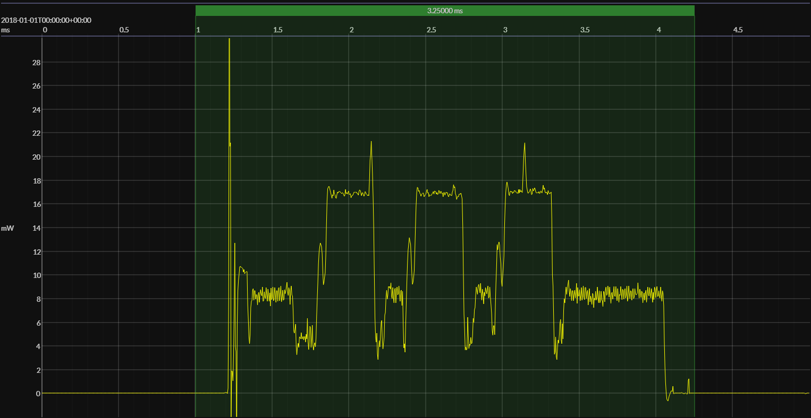

<p align="center">
    
</p>
<br>
<p align="center">
    
</p>

-----

<a id="toc"></a>

<h3 align="center">
  <a href="#installation">Installation</a>&nbsp;&#xFF5C;&nbsp;
  <a href="#usage">Usage</a>&nbsp;&#xFF5C;&nbsp;
  <a href="#examples">Examples</a>&nbsp;&#xFF5C;&nbsp;
  <a href="#contributing">Contributing</a>
</h3>

<br>

The **EM&bull;Scope** tool streamlines the capture, analysis, display, and delivery of real-time power-consumption measurements &ndash; used to characterize the overall energy efficiency of resource-constrained embedded systems.&thinsp; To encourage benchmarks for different HW/SW configurations performing comparable tasks, **EM&bull;Scope** introduces a novel metric for quantifying energy efficiency &ndash; the **EM&bull;erald**.
 
## Installation

```
npm install -g @em-foundation/emscope
```
Enter `emscope -V` from the command-line to verify that installation has succeeded.

> [!IMPORTANT]
> See [below](#updating) for important information about updating the `emscope` package when necessary.

You should then install **Joulescope Application Software** [version 1.3.9](https://download.joulescope.com/joulescope_install/index.html) onto your host computer.

> [!TIP]
> Stock installers for **Windows** and **macOS** will place this software in known locations.&thinsp; **Ubuntu** users must first unpack a `.tar.gz` file and then ensure the shell can find the `joulescope_launcher` executable along its `PATH`.

## Usage

**EM&bull;Scope** has four main modes of operation, corresponding to these `emscope` sub-commands:

<p align="center">
    
</p>

> [!TIP]
> Use `emscope help [sub-command]` to refresh your memory as well as to explore further.

Use of **EM&bull;Scope** centers around a _capture directory_ &ndash; populated initially with raw signal data acquired through the `emscope grab` sub-command.&thinsp;  Within the latter mode, you'll physically connect a **Joulescope** [JS220](https://www.joulescope.com/products/js220-joulescope-precision-energy-analyzer) or **Nordic** [PPK2](https://www.nordicsemi.com/Products/Development-hardware/Power-Profiler-Kit-2) to your target embedded system.

In practice, you'll typically begin using **EM&bull;Scope** with captures previously grabbed by others and then published within a curated **Git** repository.&thinsp; For this purpose, we'll rely upon the [em-foundation/BlueJoule](https://github.com/em-foundation/BlueJoule) benchmark repo to support the examples which follow.

> [!WARNING]
> The `BlueJoule` repo stores (large) `emscope-capture.zip` files using **Git LFS** pointers.&thinsp; We'll soon illustrate how to clone this repo as well as deflate its `emscope-capture.zip` files onto your host computer using `emscope pack --unpack`.

Once provisioned locally, you would use the `emscope scan` and `emscope view` commands to explore raw signal data captured at an earlier time &ndash; as if you had just executed `emscope grab`.

Only the original supplier of the raw data, however, would use `emscope pack` to create `emscope-capture.zip` files.&thinsp; The supplier would then commit this file (and other **EM&bull;Scope** artifacts) into the capture repository &ndash; ready for downstream consumption by others.

> [!NOTE]
> All `BlueJoule` captures record the energy consumed by different embedded HW/SW configurations otherwise performing the _same_ application task &ndash; in this case, transmitting a [prescribed BLE packet](https://github.com/em-foundation/BlueJoule/blob/main/docs/ReadMore.md#application) on all three advertising channels once per-second.
>
> We hope our embryonic `BlueJoule` repository will encourage others to [contribute captures](https://github.com/em-foundation/BlueJoule/blob/main/docs/ReadMore.md#contributing) for a wide range of embedded BLE systems &ndash; enabling more robust comparative benchmarks between different HW/SW providers who all claim _"ultra-low-power"_.

## Examples

### 🟠&ensp;recording raw power signals &emsp; <p align="right"><sup><a href="#toc">top ⤴️</a></sup></p>
<a id="grab"></a>

> [!IMPORTANT]
> Even if you don't have a **Joulescope JS220** or **Nordic PPK2** analyzer at hand, understanding typical use of `emscope grab` sets the stage for other modes of the `emscope` command illustrated later.

---

```console
$ emscope grab -J
    wrote 'capture.yaml'
    analyzing captured data...
    found 3 event(s)
    wrote 'analysis.yaml'

$ emscope grab -J -d 12
    wrote 'capture.yaml'
    analyzing captured data...
    found 12 event(s)
    wrote 'analysis.yaml'
```

> [!NOTE]
> Capture raw data using an attached **Joulescope JS220** power analyzer, wired to your target system; the `-d, --duration` option specifies the capture duration in seconds (default: 3).&thinsp; We'll explain more about the generated output shortly.

---

```console
$ emscope grab -PA
    wrote 'capture.yaml'
    analyzing captured data...
    found 3 event(s)
    wrote 'analysis.yaml'

$ emscope grab -PSv 1.8
    wrote 'capture.yaml'
    analyzing captured data...
    found 12 event(s)
    wrote 'analysis.yaml'
```

> [!NOTE]
> Capture raw data, but now using an attached **Nordic PPK2** analyzer.&thinsp; This analyzer has two alternative operating modes selected by an additional `emscope grab` option (`-A, --ampere-mode` or `-S, --source-mode`); wiring to your target HW will likely differ in each case.
>
> Unlike the **JS220**, the **PPK2** does _not_ record the **V** (voltage) signal &ndash; only the **I** (current) signal.&thinsp; The `-v, --voltage` option (default: 3.3) informs `emscope` of this value &ndash; but also specifies the voltage _supplied_ by the **PPK2** itself when `-S, source-mode` applies.

---

> [!TIP]
> We'll run the remaining series of examples within the `captures/ti-23-lp/simplelink-3V0-J` directory found in the [`BlueJoule`](https://github.com/em-foundation/BlueJoule) **Git** repository.&thinsp; If you want to play along at home, clone this repo and provision this capture directory as follows:
>
>```
> GIT_LFS_SKIP_SMUDGE=1 git clone --filter=blob:none https://github.com/em-foundation/BlueJoule.git
> cd BlueJoule
> git lfs install --local --skip-smudge
> cd captures/ti-23-lp/simplelink-3V0-J
> emscope pack --unpack
>```
>
> Alternatively, execute `emscope pack -u -C` from the root of the `BlueJoule` repo to apply this command to _all_ capture directories found therein.&thinsp; We'll have more to say about the `-C` option later on.

<br>

### 🟠&ensp;viewing captured information &emsp; <p align="right"><sup><a href="#toc">top ⤴️</a></sup></p>

---

```console
$ emscope view -s
    sleep current = 0.5 µA @ 3.1 V, standard deviation = 12.7 µA
```

> [!NOTE]
> The `-s, --sleep` option reports average power consumption during periods of inactivity within the target system &ndash; values that should align with a vendor data sheet.&thinsp; The standard deviation reflects  _recharge pulses_ which often occur during deep-sleep.

---

<a id="view-e"></a>
```console
$ emscope view -e
    A :: time =  1.18 s, energy = 30.5 µJ, duration =  3.00 s
    B :: time =  2.18 s, energy = 30.5 µJ, duration =  3.25 s
    C :: time =  3.18 s, energy = 30.8 µJ, duration =  3.00 s
    D :: time =  4.19 s, energy = 30.4 µJ, duration =  3.00 s
    E :: time =  5.20 s, energy = 30.5 µJ, duration =  3.00 s
    F :: time =  6.20 s, energy = 30.4 µJ, duration =  3.00 s
    G :: time =  7.21 s, energy = 30.4 µJ, duration =  3.25 s
    H :: time =  8.21 s, energy = 30.4 µJ, duration =  3.25 s
    I :: time =  9.21 s, energy = 30.5 µJ, duration =  3.25 s
    J :: time = 10.21 s, energy = 30.5 µJ, duration =  3.25 s
    ----
    average energy over 10 event(s): 30.5 µJ
```

> [!NOTE]
> The `-e, --events` option lists information about each period of _activity_ detected in the raw signal data.&thinsp; When benchmarking different HW/SW target configurations, a set of 10 one-second event cycles provides a reasonable sample.  

---

```console
$ emscope view -j
    wrote 'events.jls'
    launching the Joulescope File Viewer...
```

> [!NOTE]
> The `-j, --jls-file` option launches the **Joulescope File Viewer** (installed earlier) with a generated `.jls` file containing the raw signal data, annotated with markers deliniating each of the active events listed earlier.
>
><p align="center">
>    
></p>

> [!TIP]
> Somewhat daunting at first, take some time to familiarize yourself with the **Joulescope File Viewer**.&thinsp; As you start zooming in on portions of the capture &ndash; and perhaps find yourself a little lost &ndash; simply exit the program and re-run the `emscope view -j` command.

--- 

```console
$ emscope view -jA
    wrote 'event-A.jls'
    launching the Joulescope File Viewer...
    generated 'event-A.png'
```
> [!NOTE]
> This form of the `-j, --jls-file` option focuses upon a _single_ event designated through an alphabetic identifier seen [earlier](#view-e) in the output of the `emscope view -e` command.&thinsp; This variant also generates a screenshot of the event, suitable for publication.
> 
><p align="center">
>    
></p>

<br>

### 🟠&ensp;refining event detection &emsp; <p align="right"><sup><a href="#toc">top ⤴️</a></sup></p>

---

```console
$ emscope scan
    analyzing captured data...
    found 12 event(s)
    wrote 'analysis.yaml'
```

> [!NOTE]
> This command performs a baseline analysis of the raw signal data, discriminating event activity from periods of deep-sleep.&thinsp; Saving results to `analysis.yaml`, the `emscope grab` command seen [earlier](#grab) in fact performs an initial `emscope scan` after recording the data.

---

```console
$ emscope scan -t10
    analyzing captured data...
    found 10 event(s)
    wrote 'analysis.yaml'
```

> [!NOTE]
> The `-t, --trim` option updates `analysis.yaml` to contain a specific number of events bounded by &ge;&thinsp;500&thinsp;ms of inactivity on either end.&thinsp; If all goes well, a capture of duration _d&thinsp;_+&thinsp;2 (or more) seconds should yield a clean set of _d_ 1Hz events. 

--- 

```console
$ emscope scan -t10 -g5 -d1 -e10
    analyzing captured data...
    found 10 event(s)
    wrote 'analysis.yaml'
```

> [!NOTE]
> While usually sufficient, `-t, --trim` sometimes requires other `emscope scan` options to first "clean-up" the raw captured data as part of the event detection process:
> * `-g, --gap <milliseconds>` &ndash; coalesces adjacent events whose separation falls under a given threshold
> * `-d, --min-duration <milliseconds>` &ndash; removes events whose duration falls under a given threshold
> * `-e, --min-energy <microJoules>` &ndash; removes events whose energy consumption falls under a given threshold
 
For later reference, the `analysis.yaml` file written by `emscope scan` records the command options used to refine the event set.

---

> [!IMPORTANT]
> The `emscope scan` command will _always_ (re-)write the `analysis.yaml` file in the capture directory.&thinsp; Along with the `capture.yaml` file written [earlier](#grab) by `emscope grab`, this pair of special files source much of the information presented by `emscope view` &ndash; with the latter command often used in tandem with `emscope scan` to refine event analysis _before_ publishing the capture itself.

> [!TIP]
> Feel free, however, to use the `emscope scan` command within any of the capture directories published in the `BlueJoule` benchmark repository &ndash; implicitly modifying its `analysis.yaml` file.&thinsp; To revert `BlueJoule` to its original state, run the following command from anywhere inside the repo:
> ```
> git -C "$(git rev-parse --show-toplevel)" reset --hard
> ```

<br>

### 🟠&ensp;publishing captured information &emsp; <p align="right"><sup><a href="#toc">top ⤴️</a></sup></p>

---

```
emscope pack -a                                    # generate ABOUT.md
    ... add other information to the ABOUT file
emscope pack -z                                    # generate emscope-capture.zip
    ... prepare other capture directory artifacts
git commit ...   
```

> [!NOTE]
> You'll publish new captures created with `emscope grab` and refined with `emscope scan` within a **Git** repo.&thinsp; At a minimum, you'll commit the `capture.yaml` and `analysis.yaml` files described earlier as well as the (large) `emscope-capture.zip` generated here.
>
> Repo owners will often prescribe other required artifacts (such as `ABOUT.md`) as well as naming conventions for the capture directory itself.&thinsp; The repo should _not_ retain generated `.jls` files &ndash; which clients can always reproduce with `emscope view` after cloning.

> [!TIP]
> In practice, you'll regularly run `emscope pack -a` as you refine `analysis.yaml`.&thinsp; Partially populated with results from `emscope view`, the `emscope pack -a` command in fact preserves _all_ edits you've already made to the generated `ABOUT.md` file.&thinsp;
>
> The `BlueJoule` capture directories abound with examples illustrating this juxtaposition of generated data with edited information.

<br>

### 🟠&ensp;scoring energy efficiency &emsp; <p align="right"><sup><a href="#toc">top ⤴️</a></sup></p>

---

```console
$ emscope view -w
    event period:        00:00:01
    average sleep power:   1.6 µW
    ----
    representative event: 30.6 µJ
    energy per period:    32.2 µJ
    energy per day:        2.8 J
    ----
    28.72 EM•eralds
```

> [!NOTE]
> The `-w, --what-if` option summarizes the energy efficiency of previously captured power signals.&thinsp; Like all forms of `emscope view`, the underlying `analysis.yaml` file provides a source for this information but otherwise remains unmodified by this command.
>
> As you might imagine, the overwhelming percentage of energy consumed per 1&thinsp;s event-cycle happens in under 1% of real-time &ndash; an inherent and enduring trait of most "sleepy" applications for embedded systems.

---

```console
$ emscope-dev view -w 5
    event period:         00:00:05
    average sleep power:    1.6 µW
    ----
    representative event:  30.6 µJ
    energy per period:     38.7 µJ
    energy per day:         0.7 J
    ----
    119.71 EM•eralds

$ emscope view -w 2:00
    event period:         00:02:00
    average sleep power:    1.6 µW
    ----
    representative event:  30.6 µJ
    energy per period:    223.5 µJ
    energy per day:         0.2 J
    ----
    497.10 EM•eralds
```

> [!NOTE]
> The `-w, --what-if` accepts an optional `[[hh:]mm:]ss` value defining the event cycle duration &ndash; allowing us to extrapolate energy consumption in longer, more realistic periods.&thinsp; As expected, increasing cycle duration will _decrease_ energy consumption per day.

---

> [!IMPORTANT]
> The energy consumed per day will plateau as cycle duration continues to lengthen &ndash; with sleep power dominating.&thinsp; Having said that, the magnititude of target sleep power coupled with its wakeup overhead can lead to some interesting energy consumption curves.

---

```console
$ emscope view --score
    28.72 EM•eralds
$ emscope view -w 5 --score
    119.71 EM•eralds
$ emscope view -w 2:00 --score
    497.10 EM•eralds
```

>[!NOTE]
> Using the `--score` option by itself (or in conjunction with `-w`) reduces output to a single metric &ndash; the **EM•erald**.&thinsp; Starting with _energy per day_ (as reported previously), we compute _energy per month_ and then divide this value into 2400 &ndash; yielding our final score.
>
> <p align="center"><b>EM•eralds = 2400 ÷ (<i>Joules per day</i> × 30) = 80 ÷ <i>Joules per day</i></b></p>
>
> Why 2400?&thinsp; Because this number approximates the amount of energy available in the ever-popular CR2032 coin-cell battery &ndash; rated at 225&thinsp;mAH and nominally delivering 3V.
>
><p align="center"><b>CR2032 energy:&nbsp; 225 mAh × 3.6 × 3.0 V ≈ 2.43 kJ</b></p>
><p align="center"><b>1 EM•erald ≈ 1 CR2032-month</b></p>
>
> More **EM•eralds**, more efficiency....&nbsp; And while our embedded system may use other sources of energy than a CR2032 battery, the industry has always touted _"five years on a coin-cell"_ as a laudable goal &ndash; which we'll now term a <i>60 <b>EM•erald</b> application</i>.

---

```console
$ cd .../BlueJoule/captures
$ emscope view --score -C 'nrf*/zephyr-*-J'

nrf-52-dk/zephyr-2V7-J:
    30.39 EM•eralds

nrf-52-dk/zephyr-3V3-J:
    27.72 EM•eralds

nrf-54-dk/zephyr-1V8-J:
    39.61 EM•eralds

nrf-54-dk/zephyr-3V0-J:
    37.76 EM•eralds

nrf-54-dk/zephyr-3V3-J:
    30.96 EM•eralds
```

>[!NOTE]
> The `-C, --capture-glob` option illustrated here will in general enable execution of some `emscope` command within _any_ child capture directory whose path name matches a given pattern (default: `'**'`).
>
> Often run within the repo's `capture` folder to list results, the glob pattern allows further filtering using metadata encoded in each segment of the capture's relative path &ndash; here, listing scores for all **Nordic** captures executing a **Zephyr** stack and grabbed with a **JS220**.

<br>

<a id="updating"></a>
### 🟠&ensp;updating the `emscope` package &emsp; <p align="right"><sup><a href="#toc">top ⤴️</a></sup></p>

---

If you've already installed the `emscope` package, use the following pair of commands to determine whether you should update:

```
npm view @em-foundation/emscope version    ## the latest available version
emscope -V                                 ## the currently installed version
```

Alternatively, you can always "(re-)install" the `emscope` package in the usual way to ensure you have the latest version:

```
npm install -g @em-foundation/emscope 
```

---

### Enjoy the ride&thinsp;!!! **🎢**

<br>

## Contributing

At this early stage of development, the **EM&bull;Scope** team has four requests to the community at large:

🟢 &ensp; re-read this introduction &ndash; and start a Q/A thread on our [Discussion](https://github.com/em-foundation/emscope/discussions/new?category=q-a) page<br>
🟢 &ensp; play with the `emscope` command &ndash; and file [Bug](https://github.com/em-foundation/emscope/issues/new?template=bug_report.md) or [Feature](https://github.com/em-foundation/emscope/issues/new?template=feature_request.md) issues when needed<br>
🟢 &ensp; consider publishing your own capture &ndash; and [**Fork**](https://github.com/em-foundation/BlueJoule)🍴&thinsp;`BlueJoule` to get going<br>
🟢 &ensp; encourage others to engage with **EM&bull;Scope** &ndash; and then [**Star**](https://github.com/em-foundation/emscope)⭐&thinsp; **&bull;** &thinsp;[**Watch**](https://github.com/em-foundation/emscope)👀 this repo<br>


